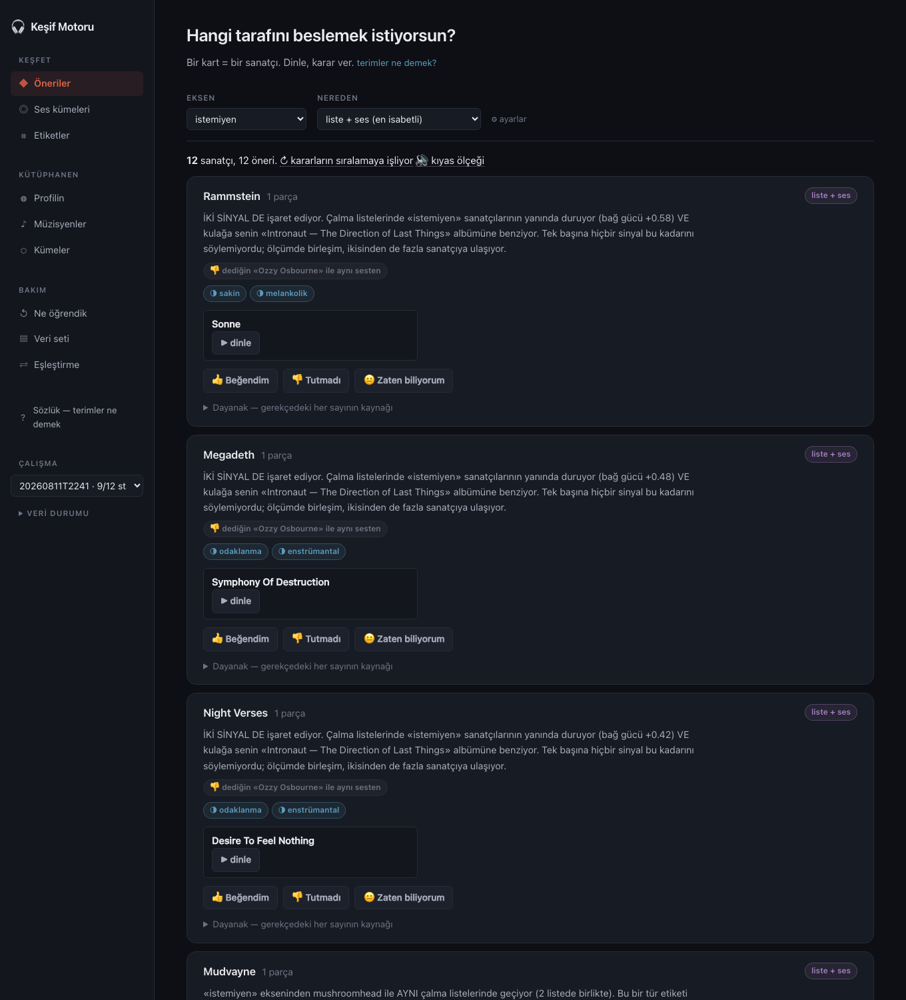
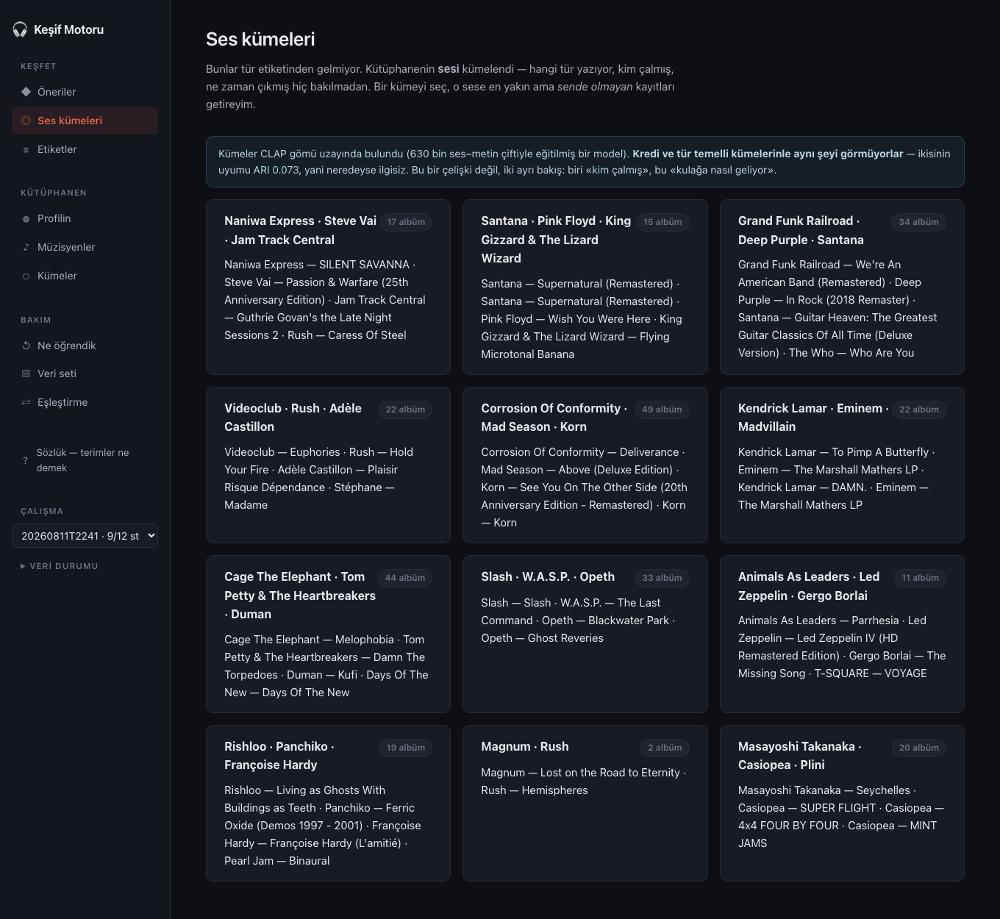

# Müzik Keşif Motoru

**Kendi FLAC kütüphanenden, kendi zevk eksenlerini çıkaran ve o eksenleri besleyen öneri motoru.**
Tür etiketine değil, sesin kendisine ve insanların çalma listelerine bakar.
Her yöntem kararı bir ölçümle alınmıştır.

<sub>*A music discovery engine built on one person's 302-album FLAC library. It derives taste axes
with fuzzy clustering, measures performance character from **source-separated stems** (drums, bass,
guitar/keys, vocals) rather than the mix, retrieves with **CLAP** audio embeddings and playlist
co-occurrence, and — unusually for a hobby project — **evaluates every ranking decision** with a
leave-one-artist-out harness. Zero running cost, no LLM in the core, no proprietary APIs.
Code and comments are in Turkish.*</sub>

**Sürüm 0.1.0** — ilk yayın sürümü ([değişiklikler](CHANGELOG.md)). Hesap aç, sevdiğin
sanatçıları yaz, kaydırarak keşfet. Sunucuya kurmak için: [`docs/yayin.md`](docs/yayin.md).



---

## Neden

> *"Ben hep DAP'tan yerel kütüphanemi dinliyorum, ancak bu böyle olunca yeni müzikler keşfedemiyorum."*

Sorun öneri eksikliği değil, **sahip olduğun müziğin bir tercih sinyali olduğunun kimse tarafından
kullanılmaması**. Ticari servisler dinleme geçmişini bilir ama kütüphaneni bilmez. Bu motor tersini
yapar: kütüphanen pozitif sinyaldir, hedef de basittir — *"j-fusion önerisi istediğimde elimde
olmayan bir şey gelsin."*

## Ne yapar

| | |
|---|---|
| **Dosyasız da başlar** | Satır başına bir sanatçı yaz ya da Spotify'ı bağla; eksenler 30 sn önizlemelerin sesinden çıkar |
| **Kütüphaneyi okur** | FLAC etiketleri → MusicBrainz → Discogs kredileri (kim çalmış) |
| **Zevk eksenleri çıkarır** | Bulanık c-ortalamalar (FCM); bir albüm birden çok eksene ait olabilir |
| **İcra karakterini ölçer** | Demucs ile stem ayrıştırma → davul/bas/gitar/vokal ayrı ayrı ölçülür |
| **Ses uzayında arar** | CLAP gömüleri (48 kHz), hubness düzeltmeli |
| **Kalabalığı dinler** | 482 çalma listesinden sanatçı birlikteliği (npmi) |
| **Etiketler** | 40 ölçüm etiketi, dört stem dengeli, hepsi denetimden geçmiş ölçütlere dayalı |
| **Kendini ölçer** | Leave-one-artist-out; hiçbir yöntem değişikliği ölçülmeden üretime girmez |
| **Kaydırarak keşfettirir** | Keşfet destesi: sağa = listeye, sola = geç, yukarı = biliyorum; kapak ve 30 sn önizlemeyle. Kaynaklar arası pay senin gerçek kararlarından (Thompson) |
| **Edinme listesi tutar** | Listem: durum (yeni / dinlendi / edindim), kütüphaneye gelince kendiliğinden «kütüphanende», Bandcamp/Qobuz bağlantıları, CSV/TXT/JSON |
| **İki dilde konuşur** | Türkçe ve İngilizce; gerekçeler kanıttan gösterim anında kurulur ve kanıtın gücünü söyler |

## Şu anki ölçümler

Gizleme sınaması: kütüphanedeki bir sanatçının **tüm** albümleri gizlenir, motora "bunu bulabilir
misin" diye sorulur. Sanatçı gizlenir, albüm değil — albüm gizlense sanatçı kütüphanede kalır ve
motor onu kredi bağından bulur; bu da tam olarak kaçınılan şeyi ("zaten biliyorum") ölçerdi.

```
erişim yolu             tavan   havuz    @10    @50   yüzdelik  görünür
melez (liste + ses)   123/147    2637   0.13   0.30      0.098        7
çalma listesi (npmi)  109/147    1724   0.13   0.27      0.059        7
ses benzerliği (CLAP) 104/147    2416   0.01   0.03      0.347        2
kadro grafiği (3 yol)   1/147      81   0.01   0.01          —        —
```

`yüzdelik` = medyan sıra / havuz boyu; **rastgele erişim 0,500 verir.** En iyi yolda gizlenen
sanatçının medyan sırası havuzun ilk %5,9'unda (0,059): rastgeleden ~8,5 kat iyi. `görünür` = önerilen sanatçıların medyan çalma listesi sayısı, yani popülerlik vekili;
kütüphanenin kendi medyanı 6.

**Bu sayı bir alt sınırdır ve bunu yazmak önemli:** gerçek etiketimiz yalnız sahip olunan 147
sanatçı için var; gizleneni geçen adayların çoğu da iyi öneri olabilir ve bu ölçülemiyor
(*missing-not-at-random*). Düzeneğin değeri mutlak seviye değil, **yöntemler arası kıyas**.

## Öğrendiklerimiz

Projenin karar günlüğü ([`docs/karar-gunlugu.md`](docs/karar-gunlugu.md)) her yöntem değişikliğini
gerekçesiyle tutar. Öne çıkanlar:

**Popülerlik yanlılığı yedi kez, yedi farklı yerde çıktı.** Ve her seferinde çözüm aynı aileden
oldu: özgüllük bir *sönümleme çarpanı* değil, **sıralama ölçütü** olarak kullanılır — kesişim
sayısı, lift, eksen-özgüllüğü, PMI, npmi, kanıt gücü, sıra kaynaşması.

**En büyük kazanç yeni bir sinyalden gelmedi.** Var olan en güçlü sinyalin doğru okunmasından
geldi: npmi'nin tavanı +1 ve iki liste onu doldurmaya yetiyordu, yani *"2 listede birlikte"* ile
*"16 listede birlikte"* aynı skoru alabiliyordu. `n/(n+k)` çarpanı recall@50'yi **0,14'ten 0,27'ye**
çıkardı — haftalarca eklenen yeni sinyallerin hepsinden fazla.

**Ölçüt ile hedef aynı şey değil.** Gizleme sınaması "sahip olduğun sanatçıyı bulabildin mi" diye
sorar; sahip olunanlar popülere kayar; dolayısıyla ölçütü kovalamak kullanıcının asıl istediğinden
uzaklaştırabilir. Ölçüldü: en yüksek recall veren ayar, önerileri kullanıcının kendi kütüphanesinden
*daha popüler* hâle getiriyordu. Tek sayıya bakılsaydı yanlış ayar seçilirdi. Artık erişim ölçütünün
yanında her zaman bir belirsizlik ölçütü raporlanır.

**Negatif sonuçlar da yazılır.** FMA veri kümesiyle eğitilen tür sınıflandırıcı kendi test kümesinde
%67,7 doğruluk verdi ve **transfer olmadı** (alan kayması). Sıfır-atışlı CLAP etiketleme istem
yanlılığı yüzünden yetmedi. `duzluk` ve `tepe_orani` ölçütleri ölü çıktı ve atıldı.

## Mimari

```
python/
  db.py              SQLite şeması — veri sözleşmesinin kod karşılığı
  metin.py           normalizasyon, album_id türetimi (DONDURULMUŞ)
  onbellek.py        önbellekli + hız sınırlı HTTP istemcisi
  degerlendirme.py   ⭐ leave-one-artist-out düzeneği
  etiket_clap.py     CLAP gömüleri, hubness düzeltmeli erişim
  ses_kume.py        etiketsiz tür keşfi (PCA-16 + k-ortalamalar)
  etiket.py          40 ölçüm etiketi, dört stem dengeli
  geri_bildirim.py   Wilson aralıkları, kararların sıralamaya etkisi
  sozluk.py          32 terim — arayüzdeki her sayının açıklaması
  ingest/            kütüphane tarama, dinleme logu
  enrich/            MusicBrainz/Discogs, stem profili, öznitelik denetimi
  discover/          altı aday stratejisi, çalma listesi hasadı
  kumeleme/          FCM, Xie-Beni, bootstrap-Jaccard stabilite
  kesif.py           Keşfet destesi, karar, Listem, dışa aktarım
  medya.py           kapak + çalınabilir parça (Deezer, doğrulamalı)
  gerekce.py         iki dilli, kanıt gücünü söyleyen gerekçe
  dil.py             Türkçe / İngilizce, dile göre sayı
web/                 Starlette + Jinja2 + elle SVG; Neon tasarım sistemi, deste (kesfet.js)
tests/               22 dosya, 285 test
docs/                mimari, veri sözleşmesi, karar günlüğü, ürün yolu, yayın rehberi
CLAUDE.md            proje anayasası — K1..K23 mimari kararları
Dockerfile, docker-compose.yml, Caddyfile   tek komutla HTTPS'li yayın
```

### Ayırt edici üç seçim

**1. İcra karakteri mikste değil, ayrılmış stem'de ölçülür.** Bir albümün "davulu yoğun mu" sorusu
mikste cevaplanamaz; gitar duvarı ölçümü bozar. Demucs `htdemucs` ile dört stem ayrılır ve her biri
ayrı ölçülür. Ölçütler geriye doğru **adımsal eleme** ile denetlenir: `parlaklik` davulda elendi
(artık payı 0,092), `zcr` perdeli stem'lerin üçünde elendi. Elenmiş ölçüte etiket asılamaz — test
bunu korur.

**2. Tür etiketi zorunlu değil: ses kendi türünü söyler.** CLAP gömü uzayında PCA-16 sonrası
k-ortalamalar, hiçbir tür etiketi kullanmadan kümeler bulur. Küme adları uydurulmaz; merkeze en
yakın sanatçılarla ifade edilir, isimlendirme kullanıcınındır. Kredi ve tür temelli kümelerle
uyumu ARI 0,073 — yani başka bir şey görüyor, ve bu bir çelişki değil iki ayrı bakış.



<sub>Hiçbir tür etiketi kullanılmadan bulundu: Kendrick Lamar · Eminem · Madvillain bir arada,
Masayoshi Takanaka · Casiopea · Plini bir arada, Slash · W.A.S.P. · Opeth bir arada.</sub>

**3. Sıfır maliyet, çekirdekte LLM yok.** MusicBrainz, Discogs (ücretsiz token), Deezer, ListenBrainz,
FMA meta verisi (CC BY 4.0). Kümeleme ve öneri her koşulda istatistikseldir; sonuç tekrarlanabilir.

## Kullanmaya başla

**Sunucuda (önerilen):** `docker compose up -d --build` — Caddy HTTPS sertifikasını kendisi
alır. Adım adım, 0 TL'lik sunucu seçeneğiyle: [`docs/yayin.md`](docs/yayin.md).

Yeni kullanıcı dosya yüklemez: `/basla`da sevdiği sanatçıları yazar (ya da Spotify'ı bağlar),
motor her birinin 30 sn önizlemesini dinleyip eksenleri çıkarır ve Keşfet destesini hazırlar.
Hesabını ve verisini `/gizlilik` sayfasından tek adımda silebilir.

## Kurulum (geliştirme)

```bash
python -m venv .venv && source .venv/bin/activate
pip install -r requirements.txt           # tüm hat + test
pip install -r requirements-aktarim.txt   # sesle aktarım (CLAP, torch CPU)
cp .env.ornek .env        # DISCOGS_TOKEN ve MUSICBRAINZ_USER_AGENT doldur
```

Yalnız web sunucusu: `requirements-sunucu.txt` (torch'suz, ~110 MB bellek).

## Kullanım

```bash
# 1 — kütüphaneyi oku ve zenginleştir
python -m python.ingest.kutuphane_tara --kaynak /yol/muzik
python -m python.enrich.mbid_eslestir          # MusicBrainz'e bağla
python -m python.enrich.krediler               # kim çalmış
python -m python.enrich.kisi_birlestir --tum   # takma ad birleştirme
python -m python.enrich.ses_ozellikleri --isci 4
python -m python.enrich.icra_profili           # stem ayrıştırma (yavaş, GPU/MPS)

# 2 — zevk eksenlerini çıkar
python -m python.enrich.matris_kur
python -m python.kumeleme.calistir

# 3 — havuzu kur ve aday üret
python -m python.discover.calma_listesi --hasat --tum
python -m python.etiket_clap --parca-gomu --asgari-liste 2
python -m python.discover.adaylar --tum-eksenler

# 4 — ölç
python -m python.degerlendirme --kapsam eksen --olcut npmi --buzulme 1
python -m python.enrich.olcut_denetimi          # öznitelik denetimi

# 5 — arayüz (kök adres Keşfet destesine gider)
python -m web.sunucu --port 8800

# 6 — yerelde sürekli çalışsın (macOS launchd; isteğe bağlı)
scripts/servis.sh kur        # durum · gunluk · yedek · kaldir
python -m python.medya       # etkin çalışmanın kapaklarını önceden çöz
```

Test: `python -m pytest tests -q`

## Veri ve gizlilik

`data/` klasörü **git'e girmez** ve girmeyecek: kişisel kütüphane taraması, önbellek, gömüler,
veritabanı. Tamamı yeniden üretilebilir — her dış çağrı önbelleklenir (K5).

FMA veri kümesinden **yalnız CC BY 4.0 meta veri** kullanılır; ses indirilmez, dağıtılmaz ve hiçbir
üretken model eğitilmez. Deezer önizlemeleri saklanmaz — imzalı URL'ler kısa ömürlüdür (900 sn),
kalıcı olan parça kimliğidir ve taze URL çalma anında alınır.

## Durum

v0.1.0: yayına hazır. Hesap tavanı ortam değişkeniyle ayarlanır (`KESIF_AZAMI_KULLANICI`);
Spotify girişi Spotify'ın kuralı gereği beş davetli hesapla sınırlı, sanatçı listesiyle başlama
yolu sınırsız. Açık işler ve gerekçeleri
[`docs/urun-yolu.md`](docs/urun-yolu.md) ve [`docs/karar-gunlugu.md`](docs/karar-gunlugu.md)
içinde. En yüksek getirili adım daha fazla geri bildirim; Keşfet destesi bunun için var.
Gerçek kararlar vekil ölçütle çelişiyor (melez gizleme sınamasında en iyi, gerçek
tercihte %25): ayrıntı karar günlüğünde, 2026-09-23.

## Lisans

[MIT](LICENSE)
